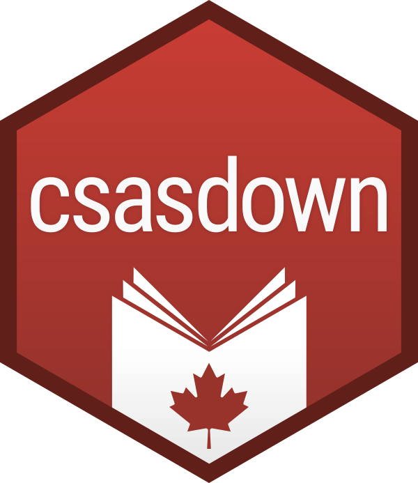

# csasdown 

> Rapports SCAS Reproductibles avec sortie en format .docx

<!-- badges: start -->
[](https://github.com/pbs-assess/csasdown/actions/workflows/R-CMD-check.yaml)
<!-- badges: end -->

csasdown est un package R permettant de produire des documents reproductibles conformes aux exigences du SCCS à l’aide de R Markdown. Il prend en charge la préparation des Documents de recherche, des Réponses des sciences, des Rapports d’avis scientifique sur les pêches et des Rapports techniques, avec une sortie générée sous forme de fichiers `.docx`.

Le package applique les exigences de mise en forme établies par le [Secrétariat canadien des avis scientifiques (SCAS)](https://www.dfo-mpo.gc.ca/csas-sccs/index-fra.htm), offre une prise en charge bilingue intégrée (français/anglais) et respecte les normes d'accessibilité requises pour les soumissions au SCAS.

La version originale de csasdown, axée sur les sorties LaTeX et PDF, est toujours disponible sous le nom de [csasdowntex](https://github.com/pbs-assess/csasdowntex). Elle peut être utilisée pour reproduire des rapports antérieurs ou pour créer des Rapports techniques, mais ne doit pas être utilisée pour la soumission de nouveaux Documents de recherche ou de Réponses des sciences au SCCS.

*This README file is also [available in English](README.md).*

## Caractéristiques

- 📄 **Quatre types de documents**: Documents de Recherche, Fisheries Science Advisory Reports (FSARs), Rapports Techniques, et Réponses des Sciences
- 🔄 **Flux de travail reproductible**: Utilise R Markdown pour passer des données aux documents dans un pipeline reproductible
- 🎨 **Formatage conforme au SCAS**: Produire des fichiers Word .docx qui utilisent les styles officiels
- 🌍 **Support bilingue**: Configurations linguistiques anglaise et française
- ♿ **Accessibilité**: Construit en tenant compte des normes d’accessibilité
- 📚 **Support multi-fichiers**: Organise de gros documents à travers plusieurs fichiers R Markdown
- 📊 **Numérotation automatique**: Les figures, tableaux et références croisées sont gérés automatiquement
- 📖 **Gestion de bibliographie**: Formatage intégré des citations et des références
- ∑ **Équations mathématiques**: Formatage approprié des équations mathématiques

## 📦 Installation

Installez la version de développement disponible sur GitHub:

``` r
# En utilisant pak (recommandé)
pak::pak("pbs-assess/csasdown")

# Ou en utilisant remotes
remotes::install_github("pbs-assess/csasdown")
```

## 🚀 Démarrage rapide

### Créer un nouveau document de recherche

Créer un nouveau document de recherche dans le répertoire de travail courant:

``` r
csasdown::draft("resdoc")
```

Ou spécifier un répertoire personnalisé existant:

``` r
csasdown::draft("resdoc", directory = "my-research-doc")
```

### Créer un rapport d'avis scientifique (FSAR)

``` r
csasdown::draft("fsar")
```

### Créer un Rapport Technique

``` r
csasdown::draft("techreport")
```

### Créer une Réponse des Sciences

``` r
csasdown::draft("sr")
```

### Rendre votre document

Ouvrez `index.Rmd` et cliquez sur le bouton "Knit" dans RStudio, ou invoquez:

``` r
csasdown::render()
```

Votre fichier .docx compilé apparaîtra dans le répertoire `_book/`.

## 📁 Structure de Projet 

Après avoir fait roulé `csasdown::draft()`, votre projet contiendra:

### Fichiers Principaux

- **`index.Rmd`**
  Fichier principal contenant les méta-données YAML (titre, auteur(e)s, dates) et le résumé. C'est ici que vous configurez les paramètres globaux du document.

- **`_bookdown.yml`**
  Fichier de configuration spécifiant l’ordre des fichiers R Markdown à fusionner, le nom de fichier de sortie et d’autres paramètres de bookdown.

- **`01-introduction.Rmd`, `02-methods.Rmd`, etc.**
  Dossiers de chapitres pour votre document. Ajoutez-les, supprimez-les ou renommez-les au besoin, en mettant à jour `_bookdown.yml` pour qu’ils correspondent.

- **`99-references.Rmd`**
  Espace réservé pour la section bibliographie (automatiquement rempli à partir de votre fichier .bib).

### Répertoires de Support

- **`figs/`**
  Stockez ici des figures et images externes. Référencez-les dans votre fichier .Rmd avec des chemins relatifs.

- **`data/`**
  Stockez les fichiers de données (.csv, .rds, etc.) utilisés dans votre analyse.

- **`csl/`**
  Fichiers de style de citation de langage (Citation Style Language) pour formater votre bibliographie.

- **`bib/`**
  Fichiers BibTeX contenant vos références (p.ex., `refs.bib`).

### Sortie

- **`_book/`**
  Un répertoire généré contenant votre fichier .docx compilé et les fichiers intermédiaires.

## Types de Documents

- Documents de recherche en anglais et en français
- Rapports techniques en anglais et en français
- Rapports d'avis en anglais et en français
- Réponses des sciences en anglais

## Écriture d'un Rapport

### Modifiez les métadonnées YAML

Modifier l’en-tête YAML dans `index. Rmd` pour personnaliser :
- Titre
- Noms d’auteurs et affiliations
- Numéros et dates de rapports
- Paramètres linguistiques
- Texte du résumé

### Ajoutez des chapitres

1. Créez un nouveau fichier `.Rmd` (p.ex., `03-résultats.Rmd`)
2. Ajoutez-le à `_bookdown.yml` dans l'ordre désiré. Pa exemple:
```yaml
rmd_files:
  - "index.Rmd"
  - "01-introduction.Rmd"
  - "02-méthodes.Rmd"
  - "03-résultats.Rmd"
  - "99-references.Rmd"
```

### Figures

Utilisez des blocs de code R avec légendes:

````markdown
```{r ma-figure, fig.cap="Ma légende de figure."}
plot(year, abundance)
```
````

Faites référence à cette figure en utilisant `Figure \@ref(fig:ma-figure)`.

Incluez une figure existante:

````markdown
```{r mon-autre-figure, fig.cap="Mon autre légende de figure."}
knitr::include_graphics("figs/mafigure.png", dpi = NA)
```
````

### Tableaux

Créez un tableau:

````markdown
```{r mon-tableau}
flextable::flextable(data) |> 
    set_caption(caption = "Ma légende de tableau.")
```
````

Faites référence à ce tableau en utilisant `Table \@ref(tab:mon-tableau)`.

### Mathématiques

Créez une équation:

```markdown
\begin{equation}
  1 + 1 = 2
  (\#eq:exemple-eq)
\end{equation}
```

Faites référence à cette équation en utilisant `Equation \@ref(eq:exemple-eq)`.

Mathématiques en ligne:

```markdown
Le symbole $\beta$ représente ...
```

### Références

Incluez des citations:

```markdown
Un énoncé [p.ex., @Smith2024; @Johnson2025]. @Johnson2025 a dit ceci.
```

Ceci deviendra:

> Un énoncé (p.ex., Smith et al. 2024, Johnson et al. 2025). Johnson et al. (2025) a dit ceci.

Avec des entrées dans la bibliographie à la fin.

### Annexes

Commencez une annexe:

```markdown
# ANNEXE `r new_appendix()`. ANALYSES SUPPLÉMENTAIRES {#app:supplementaires}
```

Faites référence à cette annexe en utilisant `Annexe \@ref(app:supplementaires)`

## Sous le capot

csasdown utilise un pipeline de rendu multi-étapes:

1. [**bookdown**](https://bookdown.org/) fusionne plusieurs fichiers R Markdown
2. [**officedown**](https://davidgohel.github.io/officedown/) convertit en Word avec les styles du SCAS
3. [**officer**](https://davidgohel.github.io/officer/) post-traite le document (injecte les pages préliminaires, remplace les signets, et assemble le document final)

## Comment contribuer

Les rapports de bogue et les demandes de fonctionnalités sont les bienvenus sur le [suivi des problèmes GitHub](https://github.com/pbs-assess/csasdown/issues).

## Licence

Ce package est licencié sous licence MIT.

## 🙏 Remerciements

csasdown est construit sur les travaux précédents du package [csasdown](https://github.com/pbs-assess/csasdown) et les excellents packages [bookdown](https://bookdown.org/), [officedown](https://davidgohel.github.io/officedown/), et [officer](https://davidgohel.github.io/officer/).
